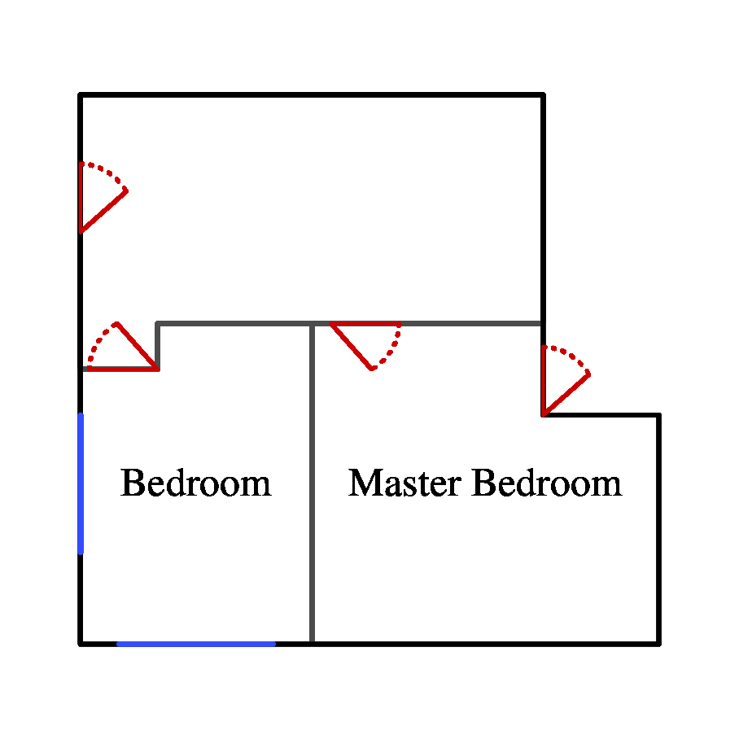
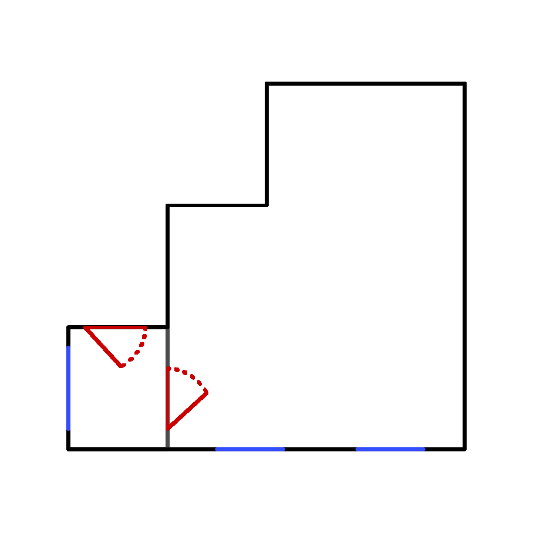

# cs494_sp24-JGraph

This directory creates a floorplan from user input.

The floorplan itself is created with jgraph, and a few predefined postscript files to make up parts like the doorways. 
User input is taken and processed in python which outputs directly to the jgraph, to generate the actual output. 

## How to Run the program

The user interface is found in the python file ui.py which can be run with `python ui.py`. This will automatically generate a jgraph file called "floorplan.jgr". 

To create a pdf output from the genereated file run `jgraph floorplan.jgr | ps2pdf - output_file.pdf`

To create a jpg output run `jgraph floorplan.jgr | convert -density 300 - -quality 100 output_file.jpg`

### User Prompts
The UI will lead the user through a series of prompts to create the floorplan. The typical format will be an origin point of the form "x y" followed by a string to specify direction. 

The first prompts create the exterior and interior walls of the building. These both follow the same format where the program will prompt for an origin point then a string to create the perimeter. This string will be a series of direction characters followed by an integer. For example, the origin `0 0` with the perimeter string `n3e3s3w3` will create a 3x3 box where the bottom left corner will be the origin. Note that if the specified room dimensions do not end at the origin point, the program will throw an error.

After all the walls are placed, the user will be prompted to select a component to place. The current options are windows and doors. Windows follow the same format as the walls and can wrap corners, but there is no verification checking that windows are placed on walls so make sure you as the user have your coordinate system correct. Doors are slightly more complicated as their origin point is set at their hinges and the single direction character will define which way the door swings out. 

The door direction is shown in this picture. This is using the `n` direction character. 

To exit the program simply enter "quit" when prompted for an additional component. 

## Example Outputs
Examples can be seen in the examples folder. The input text, output jgraph, as well as the output pdf and jpg have all been provided. 

Example 1: 

Example 2: 

Note that when looking at the .jgr files, the eps path has been edited to the correct one to accomodate the different directory location. This will only be required if you move the floorplan file to another directory. 

## Future Features 
These are the features/components that are not currently implemented but I would like to add, to create a better floorplan.
- Beds
- Washer/Drier
- Modular Kitchen
	- Stove
	- Fridge
	- Sink
	- Empty Counters
- Modular Bathroom
	- Sink
	- Bathtub
	- Toliet 

These are not currently added as each needs to be manually created in jgraph, properly scaled, and then implemented in the UI, since I have midterms this week there was not enough time to add these features. Check back after spring break to see if I got bored enough to add them :)

